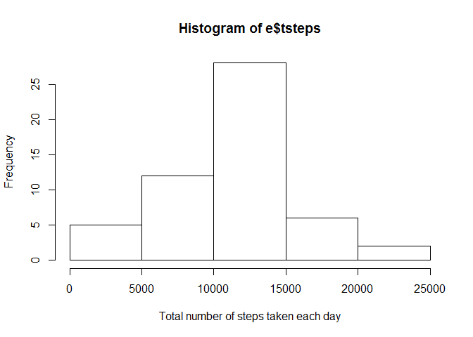
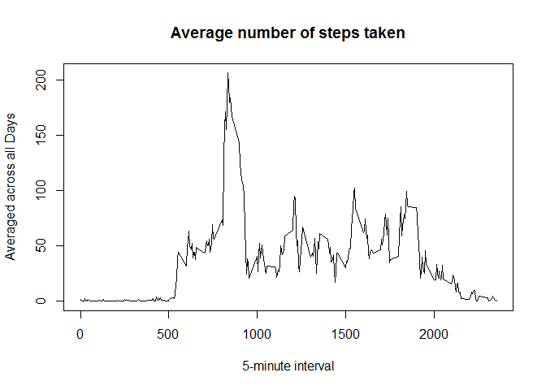

# Reproducible Research: Peer Assessment 1

##### Load needed libraries

```r
library(data.table)
library(sqldf)
```

```
## Loading required package: gsubfn
## Loading required package: proto
## Loading required package: RSQLite
## Loading required package: DBI
```

```r
library(lattice)
```

## Loading and preprocessing the data

##### Load the Activity monitoring data (https://d396qusza40orc.cloudfront.net/repdata%2Fdata%2Factivity.zip)

```r
activity = read.csv("./activity.csv", header=TRUE)
d <- activity
```

##### Transform the steps, interval into numeric and convert NA to zero

```r
d$steps <- as.numeric(as.character(d$steps))
d$interval <- as.numeric(as.character(d$interval))
d$date <- as.Date(d$date, "%Y-%m-%d")
```

-----

## What is mean total number of steps taken per day?


##### Calculate the total number of steps taken per day

```r
e <- setDT(d)[, list(tsteps = sum(steps)), by = .(date)]
```

##### Make a histogram of the total number of steps taken each day

```r
hist(e$tsteps, xlab=paste("Total number of steps taken each day"))
```

 

##### Calculate and report the mean and median of the total number of steps taken per day

```r
mean(e$tsteps, na.rm=TRUE)
```

```
## [1] 10766.19
```

```r
median(e$tsteps, na.rm=TRUE)
```

```
## [1] 10765
```
-----

## What is the average daily activity pattern?

##### Make a time series plot (i.e.  type = "l" ) of the 5-minute interval (x-axis) and the average number of steps taken, averaged across all days (y-axis)


```r
ts <- tapply(d$steps, d$interval, mean, na.rm=TRUE)
plot(row.names(ts), ts, type = "l", xlab = "5-minute interval", ylab = "Averaged across all Days", main = "Average number of steps taken")
```

 

##### Which 5-minute interval, on average across all the days in the dataset, contains the maximum number of steps?

```r
names(which.max(ts))
```

```
## [1] "835"
```

-----
## Imputing missing values


##### Calculate and report the total number of missing values in the dataset (i.e. the total number of rows with NA s)

```r
sum(is.na(activity))
```

```
## [1] 2304
```

##### Devise a strategy for filling in all of the missing values in the dataset. The strategy does not need to be sophisticated. For example, you could use the mean/median for that day, or the mean for that 5-minute interval, etc.

####### Calculate mean of steps taken for each interval

```r
avsteps <- aggregate(steps ~ interval, data = d, FUN = mean)
```

-----

##### Create a new dataset that is equal to the original dataset but with the missing data filled in.

####### Get rows from activity which have no missing steps

```r
abc <- sqldf("select activity.steps, activity.date, activity.interval
     FROM activity
     WHERE activity.steps IS NOT NULL")
```

```
## Loading required package: tcltk
```

####### Get rows from activity with missing steps and substitute steps with mean value for that interval

```r
bcd <- sqldf("select avsteps.steps, activity.date, activity.interval
     FROM activity
     LEFT JOIN avsteps
     ON activity.interval = avsteps.interval
 	WHERE activity.steps IS NULL")
```

####### Merge all activities rows which now has no missing steps

```r
xxx <- rbind(abc, bcd)
```

####### Sort activities rows in date and interval order

```r
xxx <- xxx[order(xxx$date, xxx$interval), ]
```

-----

##### Make a histogram of the total number of steps taken each day and Calculate and report the mean and median total number of steps taken per day. Do these values differ from the estimates from the first part of the assignment? What is the impact of imputing missing data on the estimates of the total daily number of steps?

####### Calculate the total number of steps taken per day

```r
e <- setDT(xxx)[, list(tsteps = sum(steps)), by = .(date)]
```

####### Make a histogram of the total number of steps taken each day

```r
hist(e$tsteps, xlab=paste("Total number of steps taken each day"))
```

 

####### Calculate and report the mean and median of the total number of steps taken per day

```r
mean(e$tsteps, na.rm=TRUE)
```

```
## [1] 10766.19
```

```r
median(e$tsteps, na.rm=TRUE)
```

```
## [1] 10766.19
```

-----

## Are there differences in activity patterns between weekdays and weekends?


For this part the  weekdays() function may be of some help here. Use the dataset with the filled-in missing values for this part.

####### Create a new factor variable in the dataset with two levels – “weekday” and “weekend” indicating whether a given date is a weekday or weekend day.

```r
xxx$date <- as.Date(xxx$date, "%Y-%m-%d")
day <- weekdays(xxx$date)
daylevel <- vector()
for (i in 1:nrow(xxx)) {
    if (day[i] == "Saturday") {
        daylevel[i] <- "Weekend"
    } else if (day[i] == "Sunday") {
        daylevel[i] <- "Weekend"
    } else {
        daylevel[i] <- "Weekday"
    }
}
xxx$daylevel <- daylevel
xxx$daylevel <- factor(xxx$daylevel)

stepsByDay <- aggregate(steps ~ interval + daylevel, data = xxx, mean)
names(stepsByDay) <- c("interval", "daylevel", "steps")
```

-----

##### Make a panel plot containing a time series plot (i.e.  type = "l" ) of the 5-minute interval (x-axis) and the average number of steps taken, averaged across all weekday days or weekend days (y-axis).

```r
xyplot(steps ~ interval | daylevel, stepsByDay, type = "l", layout = c(1, 2), xlab = "Interval", ylab = "Number of steps")
```

 
